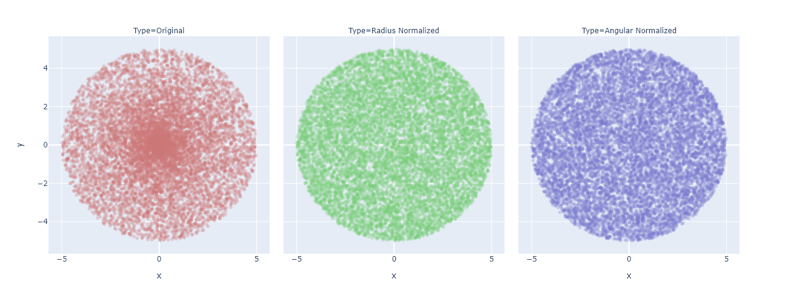
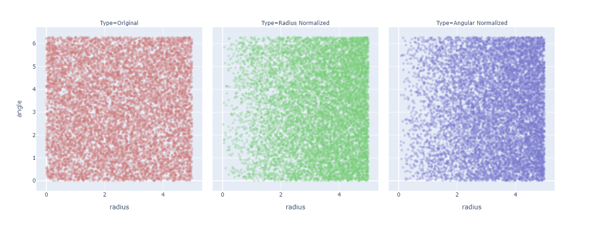
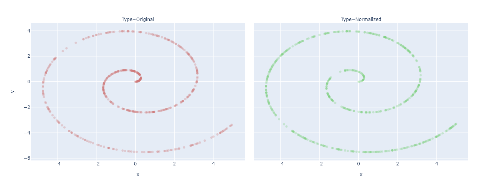
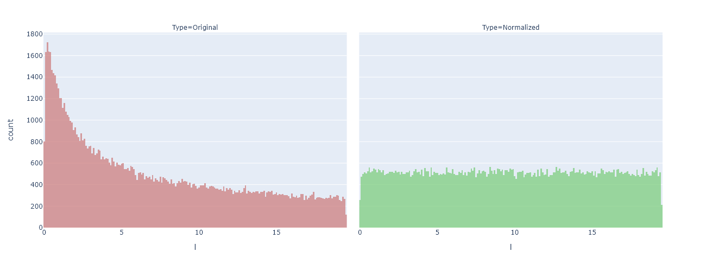
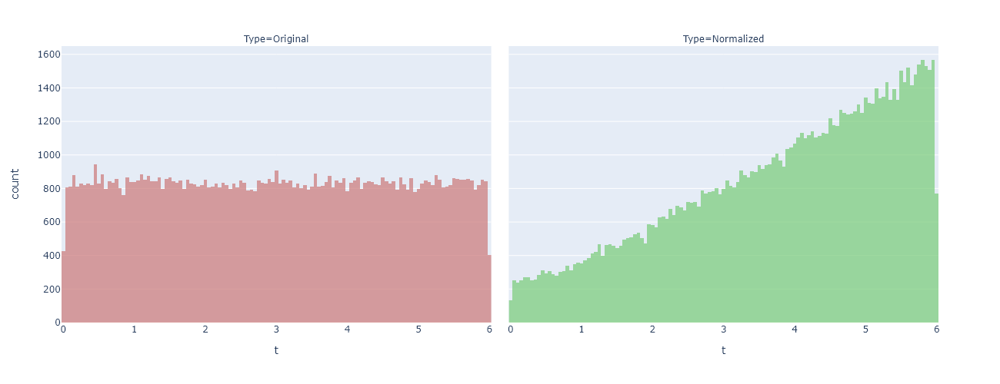
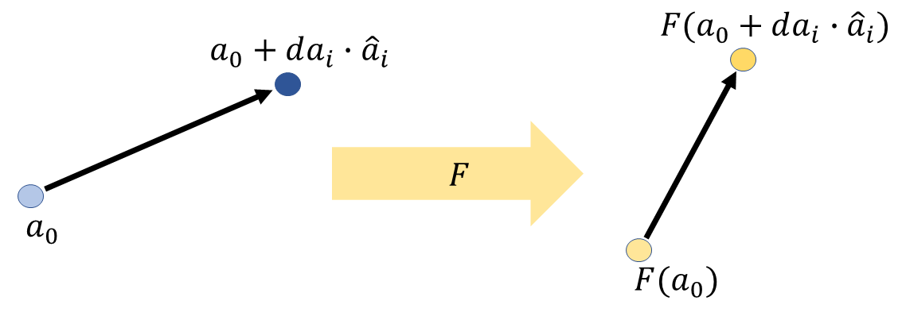

# Normalized-Functional-Sampling

## Strategy 

How can we transform a non uniform sampling method to a uniform one?

1. Given a function $f: x \mapsto y$
2. find $g: x \mapsto x'$
3. where $D_g=I_g=D_f$
4. such that $g(D)=D$
5. and $J_{f}(x')J_{g}(x)|D|=|I|$
6. where functional $J_{f}(x) := \sqrt{\bigg |\det \bigg ( \frac{\partial f}{\partial x}^T \frac{\partial f}{\partial x} \bigg ) \bigg|}$

$D$ and $I$ are refering to the domains and images of the functions, where $D \subset \mathbb{R}^m$ and $I \subset \mathbb{R}^n$. Often the solution to 5. can be found by doing a separation of variables, integrating, and then finding the inverse.
## Background

When sampling points from some sort of geometrical object, I often want to do so uniformly, e.g. "*Pick a random point from a sphere.*". For a sphere, this is not that hard to do with, for example, rejection sampling. However, I was playing around with the spiral dataset (typically use in ML), where my *ad-hoc* approach of sampling the points, gave a large bias for the points close to the center. Rejection sampling in this sceneario is impossible (1D manifold embedded in 2D and all...), and hence we need another solution. Basically what we want is, given a function and a domain, how can we alter the function, such that the resulting image is uniformly dense when sampling uniformly from the domain.
The approach we will take in this repo, is to find a new function which maps from the domain to  itself in such a way that the final image has a uniform density (see header image).

## Examples
Some examples 
### Disc
This is a classical example. We want to sample points from a disc of radius $R$, but sampling the radius and the angle independently will give a bias in favour of the points closer to the center. 
Translating this scenario to our new approach would mean that $D=[0, R] \times [0, 2\pi]$ and our *ad-hoc* function $f(r, \theta)=(r\cos \theta, r\sin \theta)^T$.
Pluggin this into our strategy gives:

$$
\begin{align*}
    \frac{\partial f}{\partial (r', \theta')} &= 
    \begin{pmatrix}
        \cos \theta & -r\sin \theta \\
        \sin \theta & r \cos \theta     
    \end{pmatrix} \\
    \bigg | \det \frac{\partial f}{\partial (r', \theta')} \bigg | &= r' \\
    |D| &= 2\pi R \\
    |I| &= \pi R^2 \\
    \bigg | \det \frac{\partial(r', \theta') }{\partial (r, \theta)} \bigg | &= \bigg | \frac{\partial r'}{\partial r}\frac{\partial \theta ' }{\partial \theta} - \frac{\partial r'}{\partial \theta}\frac{\partial \theta'}{\partial r} \bigg | \\
\end{align*}
$$

Given the radius, there should be no bias for any particular angle, and we will hence set $\theta ' (r, \theta) = \theta$, leaving us with the equation:

$$
\begin{align*}
    r' \frac{\partial r'}{\partial r} &= \frac{\pi R^2}{2\pi R}= \frac{R}{2} \\
    r' d r'&= \frac{R}{2} dr \\
    \frac{(r')^2}{2} &= \frac{R}{2}r +C \\
    r' &= \sqrt{Rr +C} \\
\end{align*}
$$

Adding the constraint that $r'(0)=0$ forces $C=0$.

$$
g(r, \theta) = (\sqrt{rR}, \theta)
$$

And our final function:

$$
    h(r, \theta) = (\sqrt{rR}\cos \theta, \sqrt{rR}\sin \theta)^T
$$

Implementing this on an actual sampler gives the following results where the above image shows the final sampling, and the lower the intermediate step after just the $g$ transformation.

  

  

### Spiral
The spiral example is the actual problem I wanted to solve. Here we have an *ad-hoc* function $f(t)=(t\cos(at+\delta),t\sin(at+\delta))^T$ with the domain $D=[0, T]$. 

$$
\begin{align*}
    \frac{d f}{d t} &= 
    \begin{pmatrix}
        \cos(at+\delta)-ta\sin(at+\delta) \\
        \sin(at+\delta)+ta\cos(at+\delta)   
    \end{pmatrix} \\
    \bigg | \det \frac{d f}{d t'}^T\frac{d f}{d t'} \bigg | &= \sqrt{(1+(at')^2} \\
    |D| &= T \\
    |I| &= \int_0^T \sqrt{(1+(at)^2} dt \\
    \bigg | \det \frac{\partial t' }{\partial t} \bigg | &= \bigg | \frac{\partial t' }{\partial t} \bigg | \\
\end{align*}
$$

Giving us the equation:

$$
\begin{align*}
    \sqrt{a+(at')^2}\frac{dt'}{dt}=\frac{|I|}{T} \\
    \sqrt{a+(at')^2}dt'=\frac{|I|}{T}dt \\
    L_a(t')=\frac{|I|}{T}t+C \\
    t'=L_a^{-1} \bigg (\frac{|I|}{T}t+C \bigg ) \\
\end{align*}
$$

Here $L_a$ is the antiderivative to $\sqrt{1+a^2x^2}$ which is not very nice looking, and its derivative I haven't even found in close formed. However, since the integrand is constantly positive, the inverse most exist and be unique. Furthermore, we can see that $L_a(T)=|I|$ together with $t'(t=T)=T$, means that $C=0$, giving us our $g_a(t)=t'(t)=L_a^{-1} \bigg (\frac{L_a(T)}{T}t\bigg )$. Putting this into our $h$ gives us a uniform sampling function for a spiral.

$$
    h_a(t) = \begin{bmatrix}
        g_a(t) \cos \big (ag_a(t)+\delta \big ) \\
        g_a(t) \sin \big (ag_a(t)+\delta\big) 
    \end{bmatrix}
$$

Again implementing this on a real sampler, this time with a couple numerical approximations of the $L^{-1}$, gives us the result. The first image is the final samples (with and without the normalization). The second image shows the histogram of the density as we go along the curve of the spiral. This was the whole goal of this repo, to flatten this curve. The final image show the difference in density in the domain.

  

  

  

## Problem Formulation and Strategy Motivation
Let $f: x \mapsto y$ be the given *ad-hoc* function with a domain $D \subset \mathbb{R}^m$ and image  $I \subset \mathbb{R}^n$. We are then looking for $g: x \mapsto x'$, such that $g(D) = D$ and ... $f(g(D))$ is uniform? We should probably find a more precise way of describing this. 
Let's introduce a function $h=f \circ g$, and look at a region $D' \subset D$. This region will have an area $\int_{D'}d|x|$, which will be some proportion of the total area $\int_Dd|x|$. Let us now transform $D' \mapsto I'$ using $h$. This image will have new area $\int_{I'} d|h|$. What we are looking for in $h$ is the property that no matter what subset $D'$ we choose, the resulting image should have the same area proportional to the total area in the domain and image respectivly. E.g. if $D'$ takes up half of the domain, it should take up half of the image. This gives us the following equation:

$$
   \frac{ \int_{I'} d|h|}{\int_{I} d|h|}  = \frac{ \int_{D'} d|x| }{\int_{D} d|x|}, \quad \forall D' \subseteq D, \quad \text{where } h(D')=I'  
$$

As stated above, this must be true for all $D'$. If we then chooses a sufficiently small $D'$ around the point $x$ ($D_x'$), and then abuse the notation a bit, we can only look at the differential form and get: $|D| \cdot d|h| = |I|\cdot d|x|$ where $|D|$ and $|I|$ are the areas of the domain and image respectivly. The final step is the to specify exactly what we mean be $d|x|$ and $d|h|$. 

Before we dive into that question, let's talk about the area/volume of a simpler object: the parallelotope. This is the object you get by looking at the span of a set of vectors and has the nice property that the signed volume is equal to the determinant of these vectors. However, if your parallelotope is of dimension $m$, where as your vectors are of dimension $n>m$, the resulting determinant, which is now meassuring the $n$-volume, will not be defined as we no longer have a square matrix. In these cases, we can instead use the square root of the so-called *Gram determinant*. Given the set of real vectors $V$, the Gram determinant is defined as $|\det V^TV|$, which gives us the squared volume.

If we now look at a general case, like the image below, where we have a vector from $a_0$ to $a_0 + da_i \cdot \hat a_i$. The vector is then given by the difference of the two, i.e. $a_0 + da_i \cdot \hat a_i-a_0 = da_i \cdot \hat a_i$. If we now look at a set of orthoganol basis vectors $\hat a_1, ... , \hat a_m$, we get that the signed volume of the parallelotope they span is given by:

$$
 \det \big [ da_1 \cdot \hat a_1 , ... ,da_m \cdot \hat a_m \big] = \det( \text{diag}\big [ da_1, ... ,da_m\big] ) \det \hat A = \Pi_{i=1}^mda_i=:d|a|
$$

Note that $\hat A$ denotes the matrix containing the basisi vectors $\hat a$ and has a determinant of $1$ as all the vectors are orthonormal.

We can do a similiar thing for the transformed version of the vector and get $F(a_0 + da_i \cdot \hat a_i) - F(a_0)$. We can nolonger carry out the subtraction, but what we can do is divide and multiply by $da_i$ which gives us the definition for the partial derivative.

$$
F(a_0 + da_i \cdot \hat a_i) - F(a_0) = \frac{F(a_0 + da_i \cdot \hat a_i) - F(a_0)}{da_i}da_i = \frac{\partial F}{\partial a_i}da_i
$$

Carying out a similir argument for the image's parallelotope we get:

$$
    \bigg| \det \bigg (\frac{\partial F}{\partial a_i} \text{diag}[da_1, ..., da_m] \bigg )\bigg |= \bigg | \det \bigg ( \frac{\partial F}{\partial a_i} \bigg ) \bigg | d|a|=:d|F|
$$

  

Now, let's get back to our problem. From the above explination, we can see that our domain area elemtn $d|x|$ quite easily reduces to $\Pi dx_i|$. Similarly $d|h|= \big| \det \frac{\partial h}{\partial x}\big| d|x|$. Now using the chain rule on the partial derivative gives us $d|h|= \big| \det \frac{\partial h}{\partial x'}\big| \big| \det \frac{\partial x'}{\partial x}\big| d|x|$. Or if $m\not = n$:

$$d|h|= \sqrt{\det \frac{\partial h}{\partial x'}^T\frac{\partial h}{\partial x'}} \cdot \bigg | \det \bigg( \frac{\partial x'}{\partial x}\bigg ) \bigg | d|x|
$$

Substituting the expanded differential forms into our previous equation gives the final equation:

$$
 \begin{align*}
    &|D| \cdot d|h| &= |I|\cdot d|x| & \Leftrightarrow \\
    \\
    &|D| \sqrt{\det \frac{\partial h}{\partial x'}^T\frac{\partial h}{\partial x'}} \cdot \bigg | \det \bigg( \frac{\partial x'}{\partial x}\bigg ) \bigg | d|x| &= |I|\cdot d|x| & \Leftrightarrow \\
    \\
    &\sqrt{\det \frac{\partial h}{\partial x'}^T\frac{\partial h}{\partial x'}} \cdot \bigg | \det \bigg( \frac{\partial x'}{\partial x}\bigg ) \bigg | |D|  &= |I| \quad \quad \text{    }&\\
 \end{align*}
$$

