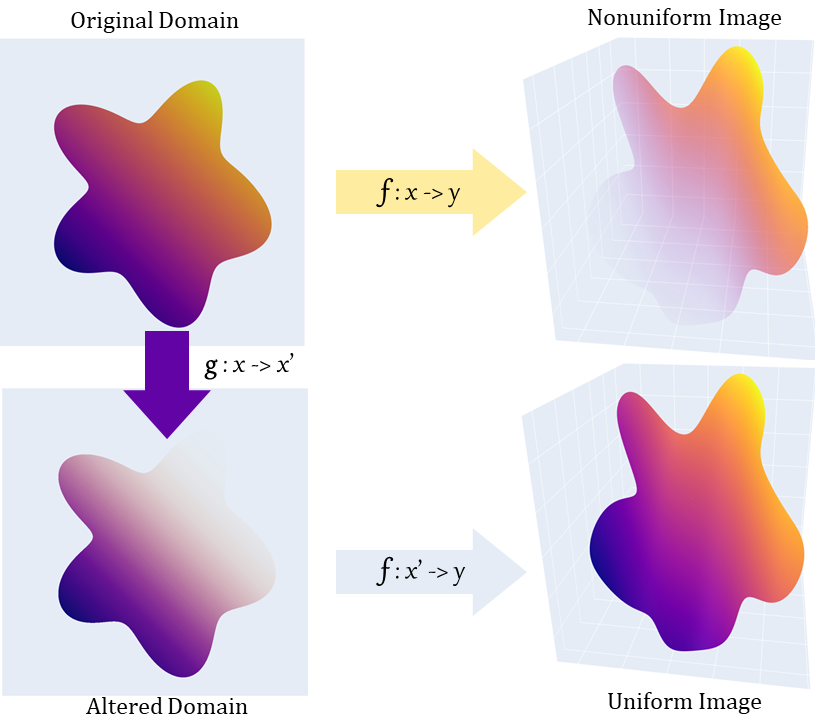

# Normalized-Functional-Sampling

## Strategy 

1. Given a function $f: x \mapsto y$
2. find $g: x \mapsto x'$
3. where $D_g=I_g=D_f$
4. such that $g(D)=D$
5. and $J_{f}(x')J_{g}(x)|D|=|I|$
6. where functional $J_{f}(x) := \sqrt{\bigg |\det \bigg ( \frac{\partial f}{\partial x}^T \frac{\partial f}{\partial x} \bigg ) \bigg|}$

$D$ and $I$ are refering to the domains and images of the functions, where $D \subset \mathbb{R}^m$ and $I \subset \mathbb{R}^n$. Often the solution to 5. can be found by doing a separation of variables, integrating, and then finding the inverse. Example of soutions can be found in the *Examples* section.
## Background - Why are we doing this?

When sampling points from some sort of geometrical object, I often want to do so uniformly, e.g. "*Pick a random point from a sphere.*". For a sphere, this is not that hard to do with, for example, rejection sampling. However, I was playing around with the spiral dataset (typically use in ML), where my *ad-hoc* approach of sampling the points, gave a large bias for the points close to the center. Rejection sampling in this sceneario is impossible (1D manifold embedded in 2D and all...), and hence we need another solution. Basically what we want is, given a function and a domain, how can we alter the function, such that the resulting image is uniformly dense when sampling uniformly from the domain.
The approach we will take in this repo, is to find a new function which maps from the domain to  itself in such a way that the final image has a uniform density (see header image).

## Problem Formulation
Let $f: x \mapsto y$ be the given *ad-hoc* function with a domain $D \subset \mathbb{R}^m$ and image  $I \subset \mathbb{R}^n$. We are then looking for $g: x \mapsto x'$, such that $g(D) = D$ and ... $f(g(D))$ is uniform? We should probably find a more precise way of describing this. 
Let's introduce a function $h=f \circ g$, and look at a region $D' \subset D$. This region will have an area $\int_{D'}d|x|$, which will be some proportion of the total area $\int_Dd|x|$. Let us now transform $D' \mapsto I'$ using $h$. This image will have new area $\int_{I'} d|h|$. What we are looking for in $h$ is the property that no matter what subset $D'$ we choose, the resulting image should have the same area proportional to the total area in the domain and image respectivly. E.g. if $D'$ takes up half of the domain, it should take up half of the image. This gives us the following equation:

$$
   \frac{ \int_{I'} d|h|}{\int_{I} d|h|}  = \frac{ \int_{D'} d|x| }{\int_{D} d|x|}, \quad \forall D' \subseteq D, \quad \text{where } h(D')=I'  
$$

As stated above, this must be true for all $D'$. If we then chooses a sufficiently small $D'$ around the point $x$ ($D_x'$), and then abuse the notation a bit, we can only look at the differential form and get: $|D| \cdot d|h| = |I|\cdot d|x|$ where $|D|$ and $|I|$ are the areas of the domain and image respectivly. The final step is the to specify exactly what we mean be $d|x|$ and $d|h|$. 

Before we dive into that question, let's talk about the area/volume of a simpler object: the parallelotope. This is the object you get by looking at the span of a set of vectors and has the nice property that the signed volume is equal to the determinant of these vectors. However, if your parallelotope is of dimension $m$, where as your vectors are of dimension $n>m$, the resulting determinant, which is now meassuring the $n$-volume, will not be defined as we no longer have a square matrix. In these cases, we can instead use the square root of the so-called *Gram determinant*. Given the set of real vectors $V$, the Gram determinant is defined as $|\det V^TV|$, which gives us the squared volume.

If we now look at a general case, like the image below, where we have a vector from $a_0$ to $a_0 + da_i \cdot \hat a_i$. The vector is then given by the difference of the two, i.e. $a_0 + da_i \cdot \hat a_i-a_0 = da_i \cdot \hat a_i$. If we now look at a set of orthoganol basis vectors $\hat a_1, ... , \hat a_m$, we get that the signed volume of the parallelotope they span is given by:

$$
 \det \big [ da_1 \cdot \hat a_1 , ... ,da_m \cdot \hat a_m \big] = \det( \text{diag}\big [ da_1, ... ,da_m\big] ) \det \hat A = \Pi_{i=1}^mda_i=:d|a|
$$

Note that $\hat A$ denotes the matrix containing the basisi vectors $\hat a$ and has a determinant of $1$ as all the vectors are orthonormal.

We can do a similiar thing for the transformed version of the vector and get $F(a_0 + da_i \cdot \hat a_i) - F(a_0)$. We can nolonger carry out the subtraction, but what we can do is divide and multiply by $da_i$ which gives us the definition for the partial derivative.

$$
F(a_0 + da_i \cdot \hat a_i) - F(a_0) = \frac{F(a_0 + da_i \cdot \hat a_i) - F(a_0)}{da_i}da_i = \frac{\partial F}{\partial a_i}da_i
$$

Carying out a similir argument for the image's parallelotope we get:

$$
    \bigg| \det \bigg (\frac{\partial F}{\partial a_i} \text{diag}[da_1, ..., da_m] \bigg )\bigg |= \bigg | \det \bigg ( \frac{\partial F}{\partial a_i} \bigg ) \bigg | d|a|=:d|F|
$$

Now, let's get back to our problem. From the above explination, we can see that our domain area elemtn $d|x|$ quite easily reduces to $\Pi dx_i|$. Similarly $d|h|= \big| \det \frac{\partial h}{\partial x}\big| d|x|$. Now using the chain rule on the partial derivative gives us $d|h|= \big| \det \frac{\partial h}{\partial x'}\big| \big| \det \frac{\partial x'}{\partial x}\big| d|x|$. Or if $m\not = n$:

$$d|h|= \sqrt{\det \frac{\partial h}{\partial x'}^T\frac{\partial h}{\partial x'}} \cdot \bigg | \det \bigg( \frac{\partial x'}{\partial x}\bigg ) \bigg | d|x|
$$

Substituting the expanded differential forms into our previous equation gives the final equation:

$$
 \begin{matrix}
    &|D| \cdot d|h| &= |I|\cdot d|x| & \Leftrightarrow \\
    \\
    &|D| \sqrt{\det \frac{\partial h}{\partial x'}^T\frac{\partial h}{\partial x'}} \cdot \bigg | \det \bigg( \frac{\partial x'}{\partial x}\bigg ) \bigg | d|x| &= |I|\cdot d|x| & \Leftrightarrow \\
    \\
    &\sqrt{\det \frac{\partial h}{\partial x'}^T\frac{\partial h}{\partial x'}} \cdot \bigg | \det \bigg( \frac{\partial x'}{\partial x}\bigg ) \bigg | |D|  &= |I| \quad \quad \text{    }&\\
 \end{matrix}
$$

## Examples

### Disc

### Spiral

When sampling points from a multidimensional distribution, it is often the case that one wants the points to be uniformly sampled from the multidimisional geometry body given. Howerver, the kanonical way of sampling from the body is usually not uniform. For example, sampling points from a disk can be done by drawing two points from a uniform distribution where the first points represent the radius of the the point, and the seconde the angle. The strategy ensures that all the drawn points are drawn from the disk, however, the sampling desnity will be greater in the center of the disk then in the outer parts.

The equation can be split up into two constraits. The first is a global one which simply restricts the function not to move points out of the domain: $g(D)=D$. The second one is a local restriction which states that the density change introduced by $f$ must be compensated for by $g$ at every point, so that the the combined density change equals the ratio between the domain and image volumes. 

## Problem Formulation
Let $g$ be a naive generating function from $T \sub R^m$ to $X\sub R^n$. For our generating function to behave nicely, we would like it to fullfill:

$$
   \frac{ \int_{X'} d|x|^m}{\int_{X} d|x|^m}  = \frac{ \int_{T'} d|t| }{\int_{T} d|t|}  
$$

The $d|t|$ syntax, refferce to the measure unit in $T$, for a normal euclidean space this is simply $\Pi dt_i$. In a similar way $d|x|^m$ refferce to the $m$-dimensional measure in $X$. For example, if $m=2$, and $n=3$, $d|x|^m$ is the area unit in 3-dimensional space. $T'$ is an arbitrary subset of $T$, and $X'=g(T')$.
The equation then expresses that for an arbitrary subset $T'$ of the domain, $T'$ takes up the same amount of the 'space' as a ratio of the whole set in the domain and in the image. 

## Example Problem
A typical example of this issue arise if we want to sample uniformly from a disk. A straight forward way of sample the points is to uniformly sample a radius $r \in [0, R]$, and an angle $\alpha \in [0, 2\pi]$. Doing so generates points in the desired disk, but with a non-uniform density. Image XXX a shows an example of 1000 generated points using this strategy, whereas the b shows the desired density distribution. To reffer back to the problem formulation, $g: [0, R] \times [0, 2\pi] \rightarrow \mathbb{R}^2$, with $T= [0, R] \times [0, 2\pi] \in \mathbb{R}^2$. And more precisly:
$$
g(r,\alpha) = 
\begin{pmatrix}
    r \cos(\alpha) \\
    r \sin(\alpha)
\end{pmatrix}
$$

Putting the data into problem formulation equation and we get:
$$
\begin{align}
    \int_{X'}d|x|^m &= \int_{T'} \bigg |\frac{\partial g}{\partial t} \bigg | d|t|   =  \int_{T'}  drd\alpha \\
    \int_{X} d|x|^m &= \pi R^2 \\
    \int_{T'} d|t| &= \int_{T'} r drd\alpha \\  
    \int_{T} d|t| &= 2\pi R \\
    \Rightarrow \\
    0 &= \int_{T'} r - \frac{R}{2} drd\alpha \quad \text{Not solvable!}

\end{align}
$$

## Solution Derivation
Lets do the same process as in the example process, but with out assuming anything about the jacobian.

$$
\begin{align}
    
 0 &= \int_{T'} \bigg | \frac{\partial g}{\partial t} \bigg | - \frac{|X|}{|T|} d|t|, \quad \forall T' \sub T \Rightarrow \\
 0 &= \bigg | \frac{\partial g}{\partial t} \bigg | - \frac{|X|}{|T|}
\end{align}
$$

